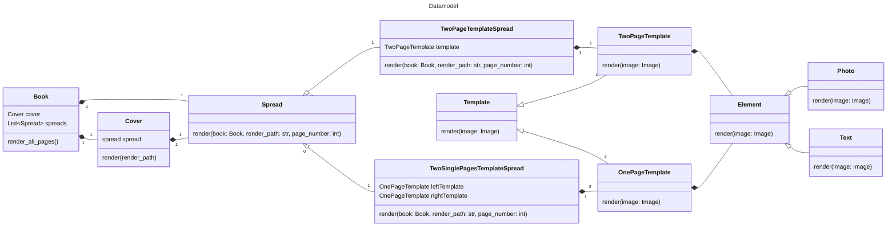

# Book Generator

## Datamodel

```mermaid
---
title: Datamodel
---

classDiagram
    direction LR
    class Book {
        Cover cover
        List~Spread~ spreads
        render_all_pages()
    }

    class Cover {
        spread spread
        render(render_path)
    }

    class Spread {
        render(book: Book, render_path: str, page_number: int)
    }

    class TwoPageTemplateSpread {
        TwoPageTemplate template
        render(book: Book, render_path: str, page_number: int)
    }

    class TwoSinglePagesTemplateSpread {
        OnePageTemplate leftTemplate
        OnePageTemplate rightTemplate
        render(book: Book, render_path: str, page_number: int)
    }

    class Template {
        render(image: Image)
    }

    class TwoPageTemplate {
        render(image: Image)
    }

    class OnePageTemplate {
        render(image: Image)
    }

    class Element {
        render(image: Image)
    }
    
    class Photo {
        render(image: Image)
    }

    class Text {
        render(image: Image)
    }

    TwoPageTemplateSpread "1" *-- "1" TwoPageTemplate
    Book "1" *-- "1" Cover
    Book "1" *-- "*" Spread
    Cover "1" *-- "1" Spread
    Template<|-- "1" TwoPageTemplate
    Template<|-- "2" OnePageTemplate
    Spread "0" <|-- "1" TwoPageTemplateSpread
    Spread "0" <|-- "1" TwoSinglePagesTemplateSpread
    TwoSinglePagesTemplateSpread "1" *-- "2" OnePageTemplate
    Element<|--Photo
    Element<|--Text
    TwoPageTemplate*--Element
    OnePageTemplate*--Element
```
