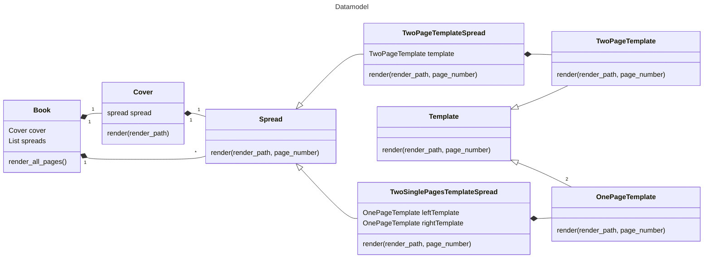

# Book Generator

## Datamodel

```mermaid
---
title: Datamodel
---

classDiagram
    direction LR
    class Book {
        Cover cover
        List<Spread> spreads
        render_all_pages()
    }

    class Cover {
        spread spread
        render(render_path)
    }

    class Spread {
        render(render_path, page_number)
    }

    class TwoPageTemplateSpread {
        TwoPageTemplate template
        render(render_path, page_number)
    }

    class TwoSinglePagesTemplateSpread {
        OnePageTemplate leftTemplate
        OnePageTemplate rightTemplate
        render(render_path, page_number)
    }

    class Template {
        render(render_path, page_number)
    }

    class TwoPageTemplate {
        render(render_path, page_number)
    }

    class OnePageTemplate {
        render(render_path, page_number)
    }


    Book "1" *-- "1" Cover
    Book "1" *-- "*" Spread
    Cover "1" *-- "1" Spread
    Template<|-- "1" TwoPageTemplate
    Spread<|--TwoPageTemplateSpread
    Spread<|--TwoSinglePagesTemplateSpread
    TwoPageTemplateSpread*--TwoPageTemplate
    TwoSinglePagesTemplateSpread*--OnePageTemplate
    Template<|-- "2" OnePageTemplate
```
